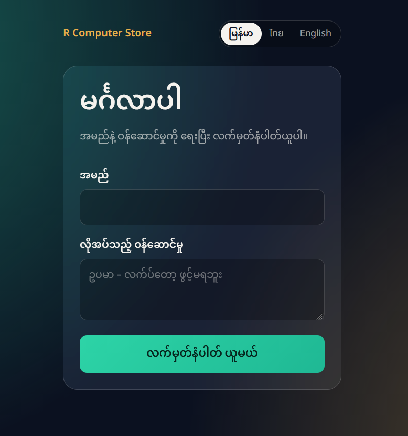
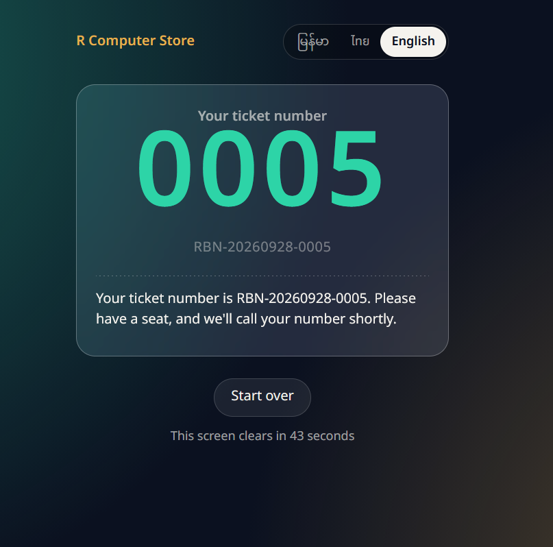
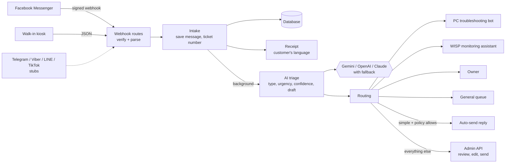

# Customer Support Ticket Triage Agent

**One intake and triage layer for every customer request, online or in person — an LLM agent reads each message, decides what kind of problem it is and how urgent, and dispatches it to whoever should handle it next.**


---

## The problem

A shop that sells computers, repairs them and runs a wireless internet service gets customer requests through several doors at once: messages on social platforms at all hours, and people walking in and standing at the counter. They arrive in different languages. Some are urgent — an internet outage, a machine that won't boot before a deadline — and some can wait until tomorrow.

The hard part isn't answering them. It's deciding, quickly and consistently, which is which, and making sure nothing is quietly lost between the person who took the message and the person who can fix it.

## What I built

A FastAPI service that sits in front of every channel and does the deciding.

A message arrives from any source. It's normalised into one shape, saved, and given a ticket number. The customer immediately gets a receipt in their own language. Then a **pydantic-ai agent** reads the conversation and returns a *typed* result — issue type, urgency, a confidence score, and a draft reply — and a routing layer turns that into a decision about who handles it: a specialist handler, the owner, or the general queue.

That dispatch step is the part I'd point at. The agent isn't generating text that a human then reads and acts on; its output is structured data that drives what happens next in the system.

**Specialist handlers are a defined interface.** `app/specialists.py` declares one class per specialist domain — currently hardware repair and network/internet — each with a `suggest_reply` method that may return a reply to replace the triage draft, or `None` to keep it. Routing to them is live and recorded on the ticket. The two handlers themselves are stubs today: they log the hand-off and return `None`. The seam is designed and tested; wiring a real backend behind it is a single method body each.

### At a glance

- **Every channel, one flow** — Facebook Messenger and a walk-in kiosk work today; Telegram, Viber, LINE and TikTok have adapter stubs. Nothing downstream of the adapter knows which platform a message came from.
- **Nothing falls through** — every message gets a ticket and a receipt even when the AI or a platform is down. Duplicate webhooks and double-taps are ignored.
- **Typed agent output** — the model fills a `TriageOutput` schema, is re-asked on malformed output, and walks a fallback chain of models when a provider is overloaded, out of quota, or has retired a model.
- **Confidence-aware** — low-confidence triage goes to a human rather than being trusted.
- **Human in the loop** — drafts wait for approval by default; simple cases can be auto-sent, and never to walk-ins.
- **Tested** — 145 tests, including a 50-thread concurrency test, all with a fake LLM and mocked platform APIs.

## Screenshots

The walk-in kiosk, in Burmese and English. The customer picks a language — which switches the whole interface, not just a label — enters their name and what they need, and gets a ticket number to wait on. That language choice travels with the message, so the receipt comes back in the same language without anything having to guess.

<table>
  <tr>
    <td align="center" valign="top">
      <br>
      <sub><b>Entry form</b>: language switcher, name, and what the customer needs</sub>
    </td>
    <td align="center" valign="top">
      <br>
      <sub><b>Ticket issued</b>: a large number to call out, plus a receipt in the customer's language</sub>
    </td>
  </tr>
</table>

## Architecture



The receipt never waits for the AI, and the AI never blocks intake. Each step can fail without losing the ticket: a failed AI call marks it `needs_manual_triage`, a failed send is logged and the reply waits for approval.

### Ticket statuses

| Status | Meaning |
|---|---|
| `new` | Just created, triage running |
| `awaiting_approval` | Triaged; the AI draft is waiting for a human |
| `needs_review` | The AI wasn't confident; a human should check its labels |
| `needs_manual_triage` | The AI call failed; sort it by hand or retriage |
| `in_progress` | A reply was sent; staff are handling it |
| `closed` | Done |

### Routing rules (first match wins)

| Condition | Route |
|---|---|
| Confidence below 0.7 | `owner` |
| Complaint, custom quote, or critical urgency | `owner` |
| Hardware repair | `pc_troubleshooting_bot` |
| Network / internet | `wisp_monitoring_assistant` |
| Everything else | `general_queue` |

## Design decisions

### Automation may only move a ticket while it's still automation's

`AUTOMATION_OWNED_STATUSES` limits what background work is allowed to change. Automation can move a ticket between `new`, `needs_review`, `needs_manual_triage` and `awaiting_approval`. Once a human is on it (`in_progress`) or it's closed, a newly arriving message can't reset the status underneath them.

This is the rule that stops a system like this becoming annoying in practice. Without it, a customer sending "any update?" would drag a ticket a technician is actively working on back into the triage queue.

### Ticket numbers are allocated atomically

Numbers look like `RBN-20260928-0005` and reset daily on the shop's local time. They come from a single `INSERT ... ON CONFLICT DO UPDATE ... RETURNING` against a daily counter row, so two requests can't be handed the same number — tested with 50 concurrent threads.

SQLite made this sharper than it sounds: `db.py` forces `BEGIN IMMEDIATE` so that a request which reads and then writes can't collide with another mid-transaction and produce "database is locked".

### Failure is isolated on purpose

Each stage commits before the next one can fail it:

- The ticket is committed **before** the receipt is sent, and before any network call — so a slow platform never holds a database transaction open.
- A failed receipt is logged, never raised.
- A failed LLM call marks the ticket `needs_manual_triage` instead of losing it.
- A specialist handler that throws is caught and the triage draft is kept.

The design goal was that every dependency can be down and the shop still ends up with a ticket and a customer who got a number.

### Customer text is untrusted input, in four layers

Customers can write anything, including instructions aimed at the model:

1. Messages go inside a delimited `<customer_messages>` block the model is told to treat as data.
2. `_neutralize()` strips tags so a customer can't close that block early.
3. The model can only fill a typed `TriageOutput` — there's no free-text channel where an injected instruction could take effect.
4. The system prompt includes a worked example of refusing an injection attempt.

The admin key is compared with `hmac.compare_digest` rather than `==`, so it isn't vulnerable to timing.

### Platform rules are enforced, not discovered at send time

Messenger only accepts normal replies within 24 hours of the customer's last message. Rather than finding that out from a failed API call, the remaining window is computed and exposed as `hours_left_to_reply` in the admin API, and sends are refused once it closes.

### Prompt behaviour came from testing, not guessing

An early draft reply told a customer "our team has been notified" when nothing had happened. The prompt now forbids the model from claiming actions were taken, and carries that case as a counter-example.

## Limitations

- **The specialist handlers are stubs.** The interface, routing and tests exist; the two handlers log and return `None`.
- **No web dashboard.** Review, edit and send all happen through the admin API (usable via the auto-generated `/docs` page), not a purpose-built UI.
- **SQLite, single instance.** Fine for one shop; there are no migrations yet, so schema changes mean recreating the database.
- **Receipt language uses script detection, not a language model** — reliable for distinct scripts, less so for languages sharing one.
- **Two live channels.** The other four adapters are stubs, and each platform's signature and reply rules still need implementing.
- **Model ids drift.** Providers retire models; a 404 in the triage log means an id in the fallback chain needs replacing.

## Tech stack

| Layer | Technology |
|---|---|
| API | FastAPI |
| Agent | pydantic-ai (typed output, retries, model fallback) |
| Models | Gemini, OpenAI or Claude, configured per environment |
| Database | SQLite via SQLAlchemy 2.0 |
| HTTP | httpx |
| Kiosk | Static HTML served by the app |
| Testing | pytest |

## Quick start

```
git clone https://github.com/thuyamaungg/customer-support-ticket-triage-agent.git
cd customer-support-ticket-triage-agent
python -m venv .venv
.venv\Scripts\activate
pip install -r requirements.txt
copy .env.example .env
```

On macOS or Linux: `source .venv/bin/activate` and `cp .env.example .env`.

Set at minimum `TRIAGE_PROVIDER` and its API key, `STORE_NAME` and `ADMIN_API_KEY` in `.env`, then:

```
uvicorn app.main:app --reload
```

The server reads `.env` only at startup. **Restart it after editing `.env`** — `--reload` does not watch that file.

| What | Where |
|---|---|
| Walk-in kiosk | http://localhost:8000/kiosk |
| Admin API docs | http://localhost:8000/docs |

### See it work without any accounts

```
python seed_demo.py --offline
python show_tickets.py
```

`--offline` uses ready-made triage results, so no API key is needed. Drop the flag to run real triage over the same samples.

Configuration options, connecting a Facebook page, the admin API reference and how to add a channel are in **[docs/OPERATIONS.md](docs/OPERATIONS.md)**.

## Project structure

```
ticket-triage-agent/
├── app/
│   ├── main.py          # FastAPI app, kiosk page
│   ├── config.py        # Settings from .env
│   ├── db.py            # Engine and sessions (BEGIN IMMEDIATE)
│   ├── models.py        # customers, tickets, messages, triage_results, ticket_counters
│   ├── schemas.py       # IncomingMessage — the shape every channel produces
│   ├── tickets.py       # Intake, atomic ticket numbers, receipts
│   ├── receipts.py      # Receipt templates and language selection
│   ├── triage.py        # pydantic-ai agent, prompt, typed output, model fallback
│   ├── routing.py       # Route and reply-policy decisions
│   ├── specialists.py   # Specialist hand-off interface
│   ├── webhooks.py      # One route per channel
│   ├── admin.py         # Admin API
│   ├── ratelimit.py     # Kiosk rate limiting
│   ├── channels/        # One adapter per platform
│   └── static/kiosk.html
├── tests/               # 145 tests — no network, no API calls
├── docs/
│   ├── OPERATIONS.md    # Configuration, Facebook setup, admin API, adding a channel
│   └── screenshots/
├── seed_demo.py         # Sample tickets for a demo
├── show_tickets.py      # Print all tickets
├── try_triage.py        # Run the agent against sample messages
└── fb_simulate.py       # Send a signed fake Facebook webhook locally
```

## Testing

```
python -m pytest -q
```

145 tests, running in about 11 seconds. The suite uses a fake LLM and mocked platform APIs, so it never calls a real service or costs money — even with live keys in `.env`.

Worth knowing what's covered: ticket-number allocation under 50 concurrent threads, Facebook signature verification and duplicate-delivery handling, receipt language selection, routing rules, the automation-owned status rule, and the admin API's reply-window enforcement.

## Roadmap

- Connect real backends behind the specialist handlers
- Telegram, Viber and LINE adapters
- A web dashboard on top of the admin API
- An offline keyword classifier as a last-resort fallback when no provider is reachable
- Alembic migrations and PostgreSQL for production

## About

Built by **Thura** — a network engineer moving into AI development.

[GitHub](https://github.com/thuyamaungg)

## License

Released under the [MIT License](LICENSE).
